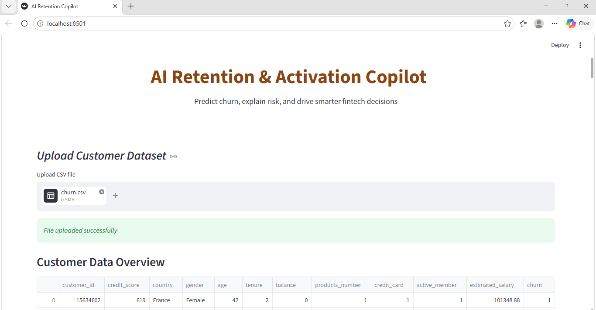
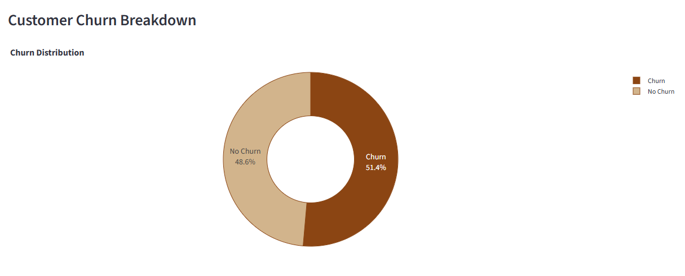
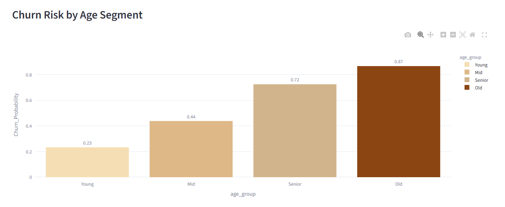

# AI Retention & Activation Copilot 🚀
This project is a simple AI-based system that helps businesses understand which customers are likely to leave (churn) and what can be done to retain them.
Instead of just predicting churn, the goal here is to **turn data into decisions**.

## 🧠 What this project does
- Predicts which customers are likely to churn  
- Identifies high-risk and high-value users  
- Explains possible reasons behind churn  
- Suggests actions to retain customers  
- Recommends financial products like FD/RD  
- Shows insights through an interactive dashboard  

## 💡 Why I built this
Many churn prediction projects stop at giving a prediction (0 or 1).  
But in real business scenarios, that’s not enough.

Companies need to know:
- Who should be targeted first?  
- Why are customers leaving?  
- What action should be taken?  
This project tries to answer those questions.

## ⚙️ How it works
1. Upload customer dataset  
2. Model predicts churn probability  
3. Customers are ranked based on priority  
4. System explains risk factors  
5. Action and product suggestions are generated  
6. Results are shown in a dashboard  

## 📊 Key features
- Churn prediction using Logistic Regression  
- Feature engineering (custom ratios & activity score)  
- Priority scoring based on churn risk and balance  
- Churn reason explanation  
- Action recommendations (engage, monitor, offer incentive)  
- Product suggestions (FD / RD / engagement)  
- Interactive Streamlit dashboard  
- Adjustable churn threshold  

## 📈 Insights generated
- Overall churn rate  
- High-risk customers  
- Revenue at risk  
- Risk patterns across age groups  

## 🛠️ Tech used
- Python  
- Pandas & NumPy  
- Scikit-learn  
- Streamlit  
- Plotly & Matplotlib
- 
## 📸 Screenshots
### Overview

### Customer Churn Breakdown

### Churn Risk by Age Segment

## ▶️ How to run
pip install -r requirements.txt
python -m streamlit run app.py

🌐 Live Demo
https://ai-retention-copilot-ibb4jcdnsvz4w7zuufowql.streamlit.app/

🚀 What can be improved
Use advanced models like Random Forest / XGBoost
Add real-time data support
Improve recommendations using ML
Integrate with backend systems

🎯 Final note
This project is not just about predicting churn — it's about helping businesses decide what to do next.

👤 Author
Daweep Kaur
